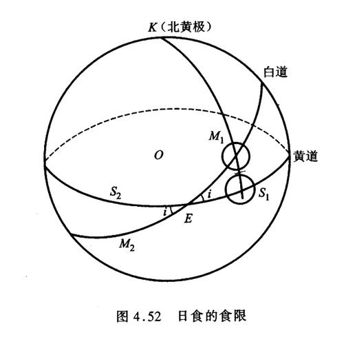

太阴历法
===================================================================================
**太阴历，简称“阴历”。是按月相朔、望周期制订的历法**。太阳的视运行轨道叫“**黄道**”，而月亮则循
行于月白，黄道面与白道面之间约有5度09分的“黄白交角”。

根据自然天象，当日、月在各自的轨道面上绕行至天球的同一经度上时，**黄经差为零，日月合朔**。此时，月
球居日、地之间，其阴面正对地球，在地球上看不到月亮。阴历把这一天定朔为每个历月的 **初一**，谓之
“**朔日**”。随着黄经差的逐日递增，每月的 **十五** 日黄经差增至最大，可见到满月的月相，此为“**望日**”。
此后 ，黄经差日复递减至最小，名之“**晦日**”。朔、望、晦日之中点，即历月之 **初七、初八**日为 **上弦
月，廿二、廿三日见下弦月**。一个朔望月周期的均值约29天有奇，乃以 **30天者为大月，29天者为小月**，
年均十二个历月，约354天有奇全一小岁。实际的阴历平年，为354天或355天不等。

> 日月黄经差值就是指太阳和月亮在黄道上的射影的角距离，就是黄经值的差

