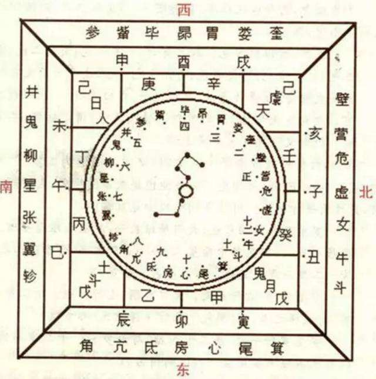

六壬其传尤古
===================================================================================
**三式者，在唐以前曰六壬、雷公、太一（乙）**，如《唐六典.太常寺太卜署》规定：“太卜令掌卜筮之法，以
占邦动用之事；丞为之贰。一曰龟，二曰兆，三曰易，四曰式”，**《唐律疏议》曰：“诸玄象器物、天文图书、
谶书、兵书、七曜历、太一、雷公式，私家不得有”，而对于六壬，则认可“士庶通用之”；唐以后雷公式亡佚，
奇门遁甲与雷公式皆用九宫，遂以遁甲代雷公与六壬、太乙合称三式，流传至今**，如《四库全书.六壬大全.提要》
记：“六壬与遁甲、太乙，世谓之三式，而六壬其传尤古。”

> 邦家：国家
>
> 曜：yao 
> 
> 谶：chèn
>
> 佚：yi 

清人程树勋在 **《壬学琐记》中也有相关佐证：“太乙、奇门、六壬，古称三式。愚以为六壬最先出，奇门次出、
太乙晚出。何以明之？观六壬纯用干支神将推演，并不用九星八门、文昌、计都等项，以是知其先出。奇门所用
天三门、地四户、天马方则采用六壬矣。太乙所用九星、八门、五符等类，则采用奇门、六壬矣，以是知二书皆
在六壬之后出。”**

一般认为，史之有壬，多在秦汉之交。然《周礼.春官宗伯.大史》之有“大师，抱天时与大师同车”句，郑众注
曰：“大出师，则大史主抱式，以知天时，处吉凶”。**“天时”作为春秋以前掌卜筮之官“太史”的占卜工具，
是最早见诸史籍关于六壬式盘的记载。则史之有壬，当又早于秦汉**。  

**到了汉代，壬家又被称“日者”**，如《史记.日者列传》之有：“自古受命而王，王者之兴何尝不以卜筮决于
天命哉！其于周尤甚，及秦可见。代王之人，任于卜者。太卜之起，由汉兴而有”；又云：“述而不作，君子义
也。今夫卜者，必法天地，象四时，顺于仁义，分策定卦，旋式正棋，然后言天地之利害，事之成败。昔先王之
定国家，必先⻳策日月，而后乃敢代；正时日，乃后入家；产子必先占吉凶，后乃有之。自伏羲作八卦，周文王
演三百八十四爻而天下治。越王勾践放文王八卦以破敌国，霸天下。由是言之，卜筮有何负哉！”《索隐》注：“
式即栻也。旋，转也。栻之形上圆象天，下方法地。用之则转天纲加地之辰，故云旋式。棋者，筮之状。正棋，
盖谓卜以作卦也”。由是见之，六壬与易卦实为国家占卜之重器也。君子法天象地，旋式定卦，明天地之利害，
判人事之成败。其所述者，天意与天命而已，述而不著，是其义也。故《老子》曰：“是以圣人抱一为天下式”；
《易.系辞》曰：“极天下之赜者存乎卦，鼓天下之动者存乎辞，化而裁之存乎变；推而行之存乎通；神而明之存
乎其人；默而成之，不言而信，存乎德行”。

**那么式盘到底是个什么样呢？《六壬神定经》录式盘的制作方法曰：“造式天中作斗杓，指天罡。次作十二辰，
中列二十八宿，四维局。地列十二辰、八干、五行、三十六禽、天门、地户、人门，鬼路四隅讫”**。

> 讫（qì）：完结，截止。

